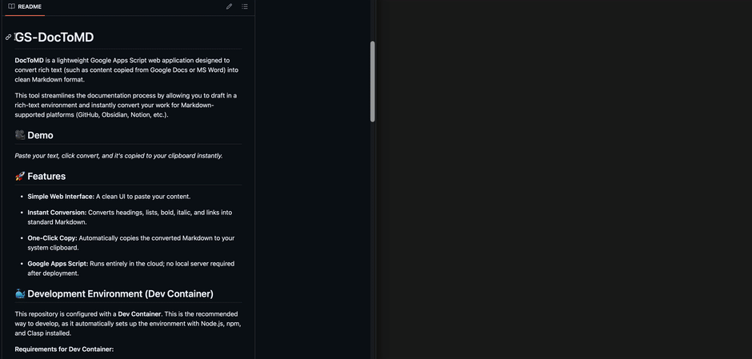

# HTML-DocToMD


A lightweight, browser-based tool that converts rich text (Google Docs, Word, or formatted HTML) into clean, formatted Markdown.

**[🔗 Live Demo](https://junghunleephd.github.io/HTML-DocToMD/)**

## **🎥 Demo**



## 🚀 Overview

**HTML-DocToMD** is a pure frontend utility designed to bridge the gap between rich text editors and Markdown environments. It allows users to paste content directly from Google Docs or similar editors and instantly get a Markdown formatted string ready for your codebase, READMEs, or documentation.

### 🔄 Evolution: From GAS to Static Web App

> **Note on Architecture:**
> Originally, this tool was built as a Google Apps Script (GAS) Web App. You can view the legacy code in the commit history.
>
> The project has been refactored into a **modern web application**. It is now a static site built with Node.js, developed in a standardized container, and deployed automatically via **GitHub Actions**.

## 📂 Project Structure

The project follows a standard modern web architecture:

```text
HTML-DocToMD/
├── .devcontainer/       # 🐳 Configuration for VS Code Dev Containers
│   └── devcontainer.json
├── .github/
│   └── workflows/       # ⚙️ CI/CD Pipeline configuration
│       └── static.yml
├── src/                 # 💻 Source code (HTML, CSS, JS)
├── dist/                # 📦 Compiled production build (generated)
├── package.json         # 📦 NPM dependencies and scripts
└── README.md
```

## **✨ Features**

- **Rich Text Conversion:** Preserves formatting (Headers, Lists, Links, Tables, Bold/Italic).

- **Smart Code Detection:** Automatically detects Monospace fonts and converts them to Markdown code blocks.

- **User Interface:** Dark/Light mode, Responsive design, and One-click copy.

- **Zero Backend:** Runs entirely in the browser.

## **💻 Development Environment**

This project utilizes a **Dev Container** to ensure a consistent development environment for all contributors, regardless of their local OS setup.

### **Using VS Code & Docker**

1. Ensure you have **Docker Desktop** and **VS Code** installed.

1. Install the [Dev Containers extension](https://marketplace.visualstudio.com/items?itemName=ms-vscode-remote.remote-containers) in VS Code.

1. Open this repository in VS Code.

1. Click **"Reopen in Container"** when prompted.

This will automatically set up a Node.js environment with all necessary dependencies pre-installed, preventing "it works on my machine" issues.

### **Local Installation (Manual)**

If you prefer not to use Docker:

1. **Clone the repository:**

```bash
git clone [https://github.com/JunghunLeePhD/HTML-DocToMD.git](https://github.com/JunghunLeePhD/HTML-DocToMD.git)
```

2. **Install Dependencies:**

```bash
npm install
```

3. **Build the Project:**

```bash
npm run build
```

## **⚙️ CI/CD Deployment Strategy**

This project uses **GitHub Actions** for continuous deployment. The workflow is defined in `.github/workflows/static.yml`.

### **How it works**

Every time code is pushed to the `main` branch, the following automated pipeline triggers:

1. **Environment Setup:** Initializes a Linux runner with **Node.js v20**.

1. **Clean Install:** Runs `npm install` to fetch dependencies defined in `package.json`.

1. **Production Build:** Executes `npm run build` to generate the optimized static files into the `./dist` folder.

1. **Artifact Upload:** Uploads the `./dist` folder as a GitHub artifact.

1. **Deployment:** Deploys the artifact specifically to **GitHub Pages**.

### **Workflow Configuration**

The specific configuration used ensures permissions are strictly scoped to `contents: read` and `pages: write` for security.

```yaml
# Key steps in our pipeline:
- name: Build
  run: npm run build

- name: Upload artifact
  uses: actions/upload-pages-artifact@v3
  with:
    path: "./dist" # Deploys only the compiled output
```

## **🤝 Contributing**

Contributions are welcome! Please ensure you test your changes in the Dev Container environment before submitting a Pull Request.
